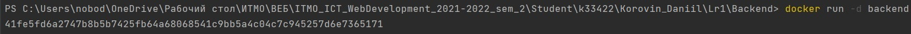

# Задание:

1. Написать Dockerfile для запуска бэкенд части проекта из курса "Web-программирование".
2. Выполнить следующие действия:

    - Изменить модель БД Django
    - Зайти в контейнер и выполнить миграции (https://www.mousedc.ru/learning/565-komanda-docker-konteyner/)

# Backend Dockerfile

```dockerfile
FROM python:3.8

# set work directory
WORKDIR /app

# set environment variables
ENV PYTHONDONTWRITEBYTECODE 1
ENV PYTHONUNBUFFERED 1

RUN apt update && apt install -y postgresql gcc python3 musl-dev

# install dependencies

RUN pip install --upgrade pip
COPY ./requirements.txt .
RUN pip install -r requirements.txt

# copy project
COPY . /app

CMD ["python", "manage.py", "runserver", "0.0.0.0:8000" ]
```

# Frontend Dockerfile

```dockerfile
FROM node:16.13

WORKDIR /app

COPY ./package.json ./

RUN npm install

COPY ./ ./

CMD ["npm", "run", "serve"] . .

# RUN npm run build

EXPOSE 8080

CMD npm run serve
```

Запустим контейнер



Применим миграции

