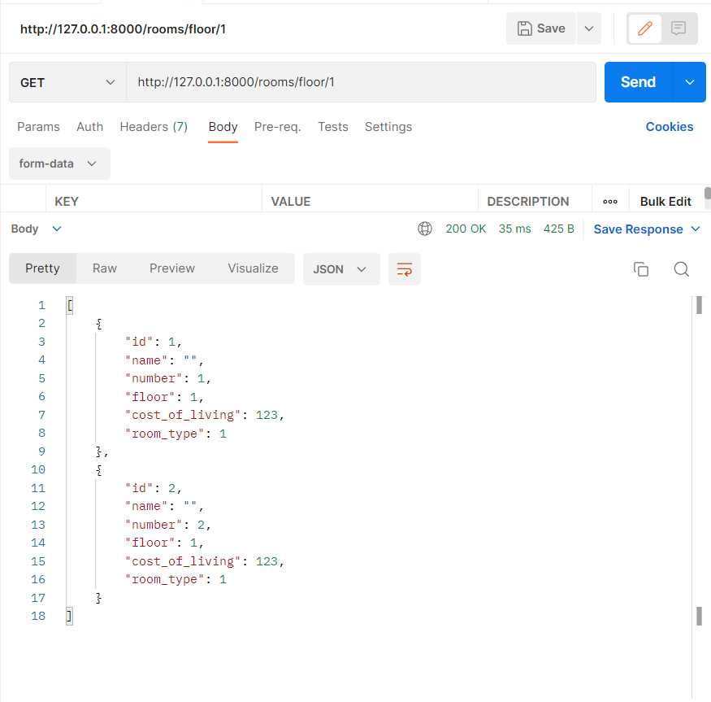

#### Задание 2.1.1

Реализвать в ручную следующие фильтры (в ручную значит, что Вам необходимо передать в url параметры, далее переопределть метод list или get_queryset, c целью взять параметры из url-адреса, выполнить с ними запрос и вернуть responce пользователю):

- принимает параметр из url-адреса и выводит отфильтрованные данные.  (GET, ListAPIView)
- принимает 2 параметра из url-адреса и выводит отфильтрованные данные. (GET, ListAPIView)
- принимает 2 параметра из url-адреса и выводит отфильтрованные данные, если пользователь авторизован и неотфильтрованные, если не авторизован. (GET, ListAPIView)

### Эндпоинты:

```python
    path('rooms/floor/<int:floor>/', RoomFloorFilterView.as_view()),
    path('rooms/number/<int:num_g>/<int:num_l>/', RoomNumbersFilterView.as_view()),
    path('rooms/floor-room-type/<int:floor>/<int:room_type>/', RoomFloorRoomTypeFilterView.as_view())
```

### Фильтрация комнат по этажам:

```python
class RoomFloorFilterView(ListAPIView):
    queryset = Room.objects.all()
    serializer_class = RoomSerializer
    permission_classes = [IsAuthenticated]

    def get_queryset(self):
        queryset = self.queryset.filter(floor=self.kwargs['floor'])
        return queryset
```



### Фильтрация и диапазон номеров комнат:

```python
class RoomNumbersFilterView(ListAPIView):
    queryset = Room.objects.all()
    serializer_class = RoomSerializer
    permission_classes = [IsAuthenticated]

    def get_queryset(self):
        queryset = self.queryset.filter(number__gte=self.kwargs['num_g'], number__lte=self.kwargs['num_l'])
        return queryset
```


### Фильтрация номеров по этажу и типу комнаты:

```python
class RoomFloorRoomTypeFilterView(ListAPIView):
    queryset = Room.objects.all()
    serializer_class = RoomSerializer

    # permission_classes = [IsAuthenticated]

    def get_queryset(self):
        queryset = self.queryset.all()
        if not self.request.user.is_anonymous:
            queryset = queryset.filter(floor=self.kwargs['floor'], room_type=self.kwargs['room_type'])
        return queryset
```

