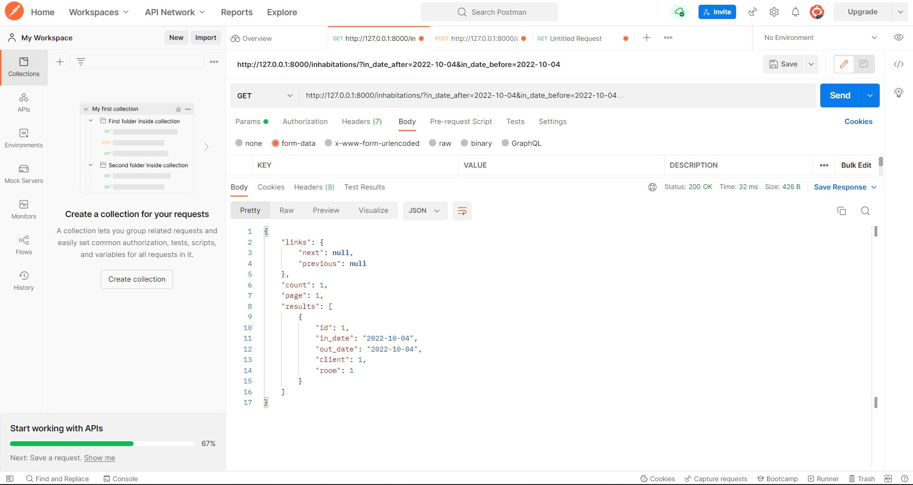

#### Задание 2.1.2

Реализвать в ручную следующие фильтры (Необходимо использовать библиотеку django-filters:

- сортировка по дате, поиск, поиск по полям из связной таблицы
- сортировка в диапазоне цен, дат или каких-либо других числовых значений

### Регистрируем django-filters и добавляем методы фильтрации по умолчанию:

```python
'DEFAULT_FILTER_BACKENDS':
        ['django_filters.rest_framework.DjangoFilterBackend']
```

### Сортировка по дате уборки, фильтрация по имени уборщика (связная таблица), поиск по дню уборки и по убираемому этажу:

```python
class CleaningViewSet(ModelViewSet):
    queryset = Cleaning.objects.all()
    serializer_class = CleaningSerializer
    permission_classes = [IsAuthenticated]

    filter_backends = (DjangoFilterBackend, OrderingFilter, SearchFilter,)
    filter_fields = ['cleaner__full_name']
    search_fields = ['cleaning_day', 'cleaning_floor']
    ordering_fields = ['cleaning_day']
    ordering = ['cleaning_day']
```


### Фильтрация в диапазоне дат заселения:

```python
class InhabitationViewSet(ModelViewSet):
    queryset = Inhabitation.objects.all()
    serializer_class = InhabitationSerializer
    permission_classes = [IsAuthenticated]

    filter_backends = [DjangoFilterBackend, OrderingFilter]
    filterset_class = DateFilter
    ordering_fields = ['in_date']
    ordering = ['in_date']
    pagination_class = StandardResultsSetPagination
```

