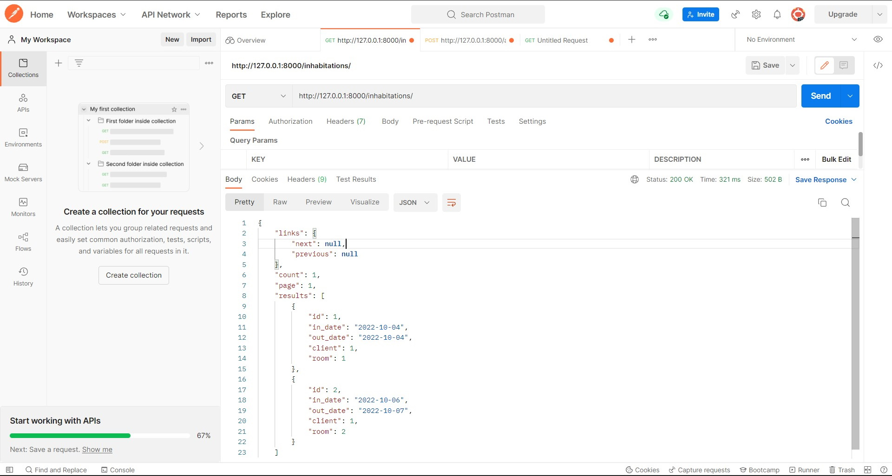

#### Задание 2.2.2

Написать и применить метод пагинации, который, кроме обычного вывода вернет количество страниц пагинации и номер текущей страницы

### Кастомный класс пагинации:

```python
class StandardResultsSetPagination(PageNumberPagination):
    page_size = 5
    page_size_query_param = 'page_size'

    def get_paginated_response(self, data):
        return Response({
            'links': {
                'next': self.get_next_link(),
                'previous': self.get_previous_link()
            },
            'count': self.page.paginator.num_pages,
            'page': self.page.number,
            'results': data
        })
```

### Использование во вью:

```python  
    pagination_class = StandardResultsSetPagination
```
### Пример:

```python
class InhabitationViewSet(ModelViewSet):
    queryset = Inhabitation.objects.all()
    serializer_class = InhabitationSerializer
    permission_classes = [IsAuthenticated]

    filter_backends = [DjangoFilterBackend, OrderingFilter]
    filterset_class = DateFilter
    ordering_fields = ['in_date']
    ordering = ['in_date']
    pagination_class = StandardResultsSetPagination
```

