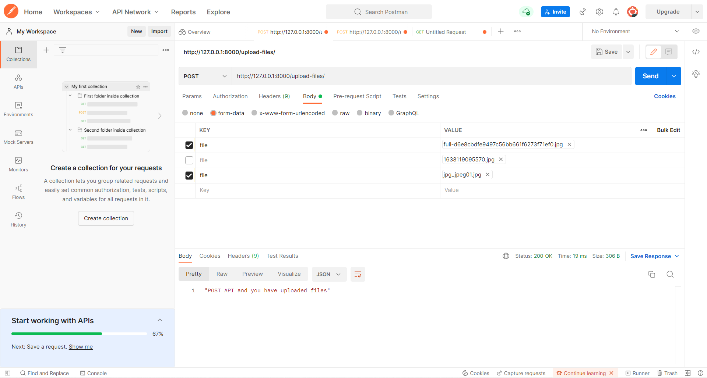
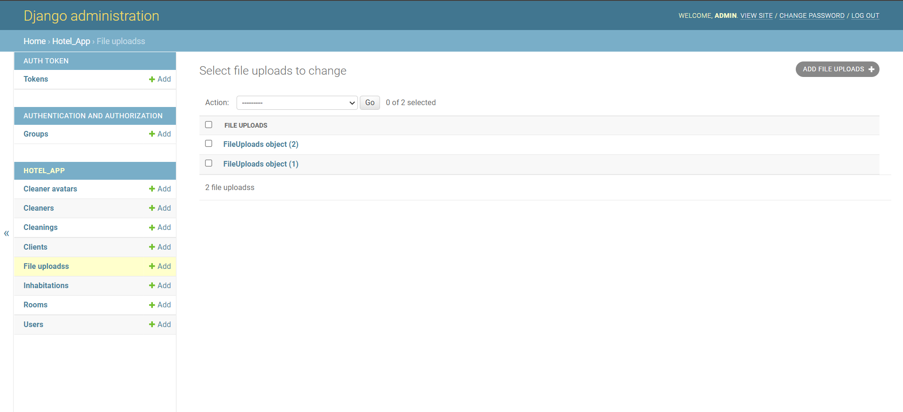

#### Задание 2.3.1

Реализовать следующие ендпоинты:

- Ендпоинт для загрузки файлов, с указанием внешнего ключа на связный объект и сохранением имени и размера файла в базе данных.
- Ендпоинт для сохранения нескольких файлов и валидации на максимальный размер файла и доступные для загрузки расширения файлов.

### Модель файла - изображения участника:

```python
class UploadAvatarClient(ViewSet):
    queryset = CleanerAvatar.objects.all()
    serializer_class = CleanerAvatarSerializer
    permission_classes = [IsAuthenticated]

    def create(self, request, *args, **kwargs):
        file_uploaded = request.FILES.get('file_uploaded')
        cleaner = request.POST.get('cleaner')
        content_type = file_uploaded.content_type
        file_name = file_uploaded.name
        file_size = file_uploaded.size
        serializer = self.serializer_class(data={"file": file_uploaded, "cleaner": cleaner, "file_size": file_size})
        serializer.is_valid()
        serializer.save(file_name=file_name)
        response = f"POST API and you have uploaded a {content_type} file {file_name}"
        return Response(response)
```

### Валидатор:

```python
@deconstructible
class FileValidator(object):
    error_messages = {
        'max_size': ("Ensure this file size is not greater than %(max_size)s."
                     " Your file size is %(size)s."),
        'min_size': ("Ensure this file size is not less than %(min_size)s. "
                     "Your file size is %(size)s."),
        'content_type': "Files of type %(content_type)s are not supported.",
    }

    def __init__(self, max_size=None, min_size=None, content_types=()):
        self.max_size = max_size
        self.min_size = min_size
        self.content_types = content_types

    def __call__(self, data):
        if self.max_size is not None and data.size > self.max_size:
            params = {
                'max_size': filesizeformat(self.max_size),
                'size': filesizeformat(data.size),
            }
            raise ValidationError(self.error_messages['max_size'],
                                  'max_size', params)

        if self.min_size is not None and data.size < self.min_size:
            params = {
                'min_size': filesizeformat(self.min_size),
                'size': filesizeformat(data.size)
            }
            raise ValidationError(self.error_messages['min_size'],
                                  'min_size', params)

        if self.content_types:
            content_type = magic.from_buffer(data.read(), mime=True)
            data.seek(0)

            if content_type not in self.content_types:
                params = {'content_type': content_type}
                raise ValidationError(self.error_messages['content_type'],
                                      'content_type', params)

    def __eq__(self, other):
        return (
                isinstance(other, FileValidator) and
                self.max_size == other.max_size and
                self.min_size == other.min_size and
                self.content_types == other.content_types
        )


file_validator = FileValidator(max_size=1024 * 100,
                               content_types=("image/jpeg",))


class FileUploads(models.Model):
    file = models.FileField(validators=[file_validator])
```

### Сериализатор для аватара:

```python
class CleanerAvatarSerializer(ModelSerializer):
    file = serializers.FileField()

    class Meta:
        model = CleanerAvatar
        fields = ['file', 'cleaner', 'file_size']
```


### Сериализатор для файлов:

```python
class FileUploadsSerializer(ModelSerializer):
    class Meta:
        model = FileUploads
        fields = ['file']
```

### Вью для загрузки одного файла:

```python
class UploadAvatarClient(ViewSet):
    queryset = CleanerAvatar.objects.all()
    serializer_class = CleanerAvatarSerializer
    permission_classes = [IsAuthenticated]

    def create(self, request, *args, **kwargs):
        file_uploaded = request.FILES.get('file_uploaded')
        cleaner = request.POST.get('cleaner')
        content_type = file_uploaded.content_type
        file_name = file_uploaded.name
        file_size = file_uploaded.size
        serializer = self.serializer_class(data={"file": file_uploaded, "cleaner": cleaner, "file_size": file_size})
        serializer.is_valid()
        serializer.save(file_name=file_name)
        response = f"POST API and you have uploaded a {content_type} file {file_name}"
        return Response(response)
```

### Вью для нескольких файлов:

```python
class UploadFiles(ViewSet):
    queryset = CleanerAvatar.objects.all()
    serializer_class = FileUploadsSerializer
    permission_classes = [IsAuthenticated]

    def create(self, request):
        files = request.FILES.getlist('file')
        file_serializers = []
        for file in files:
            print(file)

            serializer = self.serializer_class(data={"file": file})
            try:
                serializer.is_valid(raise_exception=True)
                file_serializers.append(serializer)
            except ValidationError as err:
                return HttpResponseBadRequest(err)

        for serializer in file_serializers:
            serializer.save()
        response = f"POST API and yo
```

### Загрузка одного файла:


### Загрузка двух файлов:





### Ошибки:


