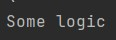
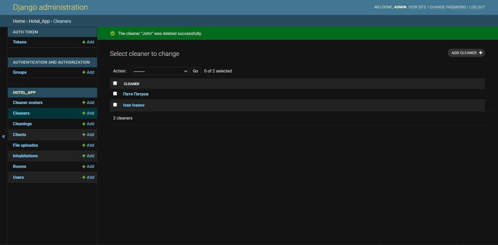
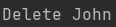

#### Задание 2.4.1

Реализовать 3 сигнала, которые:

- Вызывает логику, во время создания экземаляра объекта.
- Сохраняет значения выбранных полей в таблице в специальные поля для хранения предыдущих значений при обновлении объекта.
- При удалении объекта записывает информацию об удалении в лог реализованный любым образом.

### Для регистрации сигналов добавим конфигурацию ready в apps.py:

```python
class HotelAppConfig(AppConfig):
    default_auto_field = 'django.db.models.BigAutoField'
    name = 'hotel_app'

    def ready(self):
        import hotel_app.signals
        super().ready()
```

### Сигнал 1: создание уборщика:

```python
@receiver(post_save, sender=Cleaner)
def save_logic(sender, instance, created, **kwargs):
    if created:
        print("Some logic")
```




### Сигнал 2: обновление данных о номерах телефона уборщика с сохранением старого номера:

В модель участника добавлено поле previous_vaccination

```python
@receiver(pre_save, sender=Cleaner)
def update(sender, instance, **kwargs):
    try:
        prev_instance = Cleaner.objects.get(id=instance.id)
        instance.old_phone = prev_instance.phone
    except:
        pass
```


### Поменяем телефон ещё раз:


### Сигнал 3: удаление уборщика и логирование:

```python
@receiver(post_delete, sender=Cleaner)
def delete_log(sender, instance, **kwargs):
    print(f"Delete {instance.full_name}")
```




