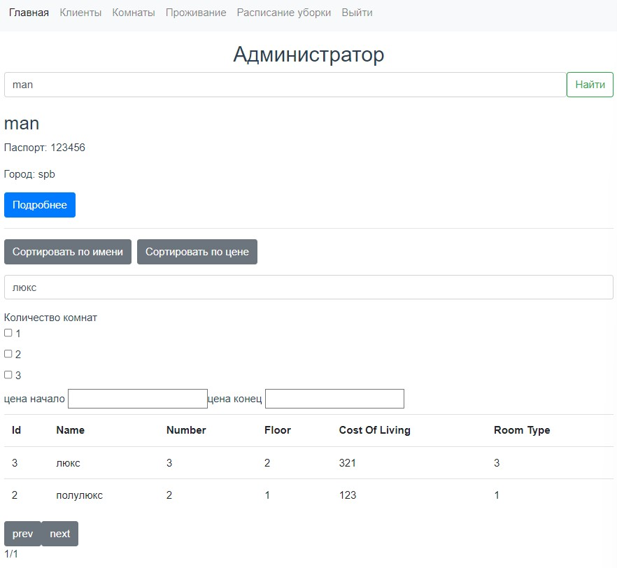

#### Задание 4.1.1

Необходимо реализовать интерфейс списков объектов, в котором подключить фильтры из второй лабораторной. В интерфейсе должен быть обеспечен следующий функционал:

- сортировка объектов.
- пагинация.
- поиск по объектам.
- фильтрация с чекбоксами.
- фитры на диапазон.

Можно сказать, необходимо реализовать страничку с фильтрами, как в интернет магазине и подключить к бэкенду.

### crm отеля: 

### Включена сортировка по цене. Как видим, количество страниц тоже обновляется:

### Включен фильтр на количество комнат в номере:

### Реализован поиск по имени номера:

### Реализован поиск по имени клиента:

